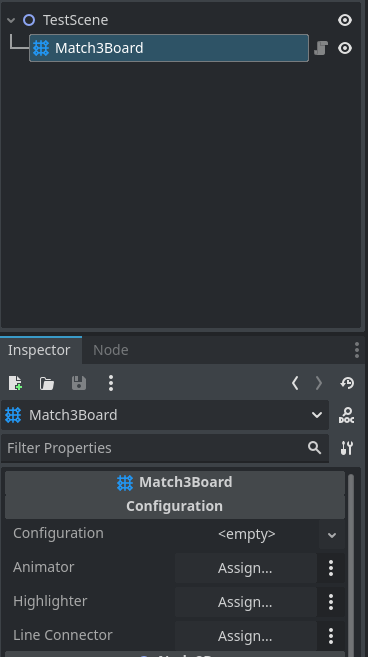
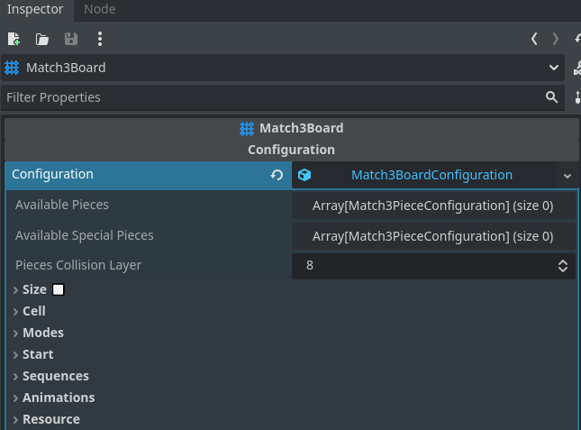

	

<h3 align="center">Match3 Board</h3>

  

	The core logic and functionality you need to build engaging match-3 games
	 
	·
	<a href="https://github.com/ninetailsrabbit/match3-board/issues/new?assignees=ninetailsrabbit&labels=%F0%9F%90%9B+bug&projects=&template=bug_report.md&title=">Report Bug</a>
	·
	<a href="https://github.com/ninetailsrabbit/match3-board/issues/new?assignees=ninetailsrabbit&labels=%E2%AD%90+feature&projects=&template=feature_request.md&title=">Request Features</a>
  

 
 

- [📦 Installation](#-installation)
- [Quick start 🚀](#quick-start-)
  - [Download and enable the plugin](#download-and-enable-the-plugin)
  - [Add the `Match3Board` node to your scene](#add-the-match3board-node-to-your-scene)
  - [Create a `Match3BoardConfiguration` resource](#create-a-match3boardconfiguration-resource)
    - [Available normal \& special pieces](#available-normal--special-pieces)
      - [Match3PieceConfiguration](#match3piececonfiguration)
        - [Scene](#scene)
        - [ID](#id)
        - [Name \& Description](#name--description)
        - [Weight](#weight)
        - [Type](#type)
        - [Shape](#shape)
        - [Color](#color)
        - [Priority](#priority)
        - [Pieces collision layer](#pieces-collision-layer)
        - [Can be](#can-be)
- [Match3 Editor preview 🪲](#match3-editor-preview-)

# 📦 Installation

1. [Download Latest Release](https://github.com/ninetailsrabbit/match3-board/releases/latest)
2. Unpack the `ninetailsrabbit.match3_board` folder into your `/addons` folder within the Godot project
3. Enable this addon within the Godot settings: `Project > Project Settings > Plugins`

To better understand what branch to choose from for which Godot version, please refer to this table:
|Godot Version|match3-board Branch|match3-board Version|
|---|---|--|
||`main`|`2.x`|

# Quick start 🚀

This plugin shows in a simple way the customisation of to setup a Match3 Board and get started in no time.

For a quick start, do the following steps:

## Download and enable the plugin

Check the [Godot documentation](https://docs.godotengine.org/en/stable/tutorials/plugins/editor/installing_plugins.html) if you have not done so before

## Add the `Match3Board` node to your scene

You will see nothing in the `2D` tab and it's ok, we need to create some initial configuration before seeing anything on the screen.

You should be able to see a few exported parameters:

- **Configuration:** This is a `Resource` that holds the important board configuration.
- **Animator (Optional):** This links a `Match3Animator` node that contains your custom animations
- **Highlighter (Optional):** This links a `Match3Highlighter` node that contains your custom highlights
- **Line Connector (Optional):** This links a `Match3LineConnector` node that contains a custom `Line2D` to use when the selected mode is `ConnectLine`

## Create a `Match3BoardConfiguration` resource

The advantage of using one resource for the configuration is that you can create and save as many as you want to create different boards.

Once you create one you will see this new fields in the editor:

### Available normal & special pieces

The board internally uses the `Match3PieceConfiguration` Resource to know how to instantiate the pieces.

In order for the board to know they exist, the normal and special pieces must have an associated `Match3PieceConfiguration` and add it to these arrays.

#### Match3PieceConfiguration

##### Scene

The piece scene that will be instantiated, **is mandatory that the root node have attached a script that inherits from `Match3Piece`**

When you create a new `Match3Piece` scene, you'll see that the script contains exportable parameters, they are automatically initialised based on this Match3PieceConfiguration so your values will not be taken into account, it's recommended to set this values only on `Match3PieceConfiguration`

##### ID

The unique id for this piece, **if you left this field empty an error will be thrown when initializing the board in the `SceneTree`**.

##### Name & Description

PPurely informative for your use case, **these are optional fields.**

##### Weight

This field is a `Match3PieceWeight` resource that only needs a weight value. This is used to randomly generate the pieces in the board when enter the `Fill` state. The higher the value of the weight for the piece, the more likely it is to come out.

This value it's only used by pieces of `Normal` type.

##### Type

The type of the piece, there is available 3 options:

- **Normal**: A normal piece that can be combined with others through the `match_with()` function
- **Special**: A special piece that can be triggered and execute a special action
- **Obstacle**: An obstacle piece, this piece cannot be moved.

##### Shape

The custom shape for this piece, this is a text value which represents the shape of the piece.

##### Color

This color is informative just like the `shape`, it does not apply this colour to the piece on the board.

##### Priority

The priority is used at the time of consumption as a sequence if it is a `Normal` piece or at the time of execution if it is a `Special` piece.

##### Pieces collision layer

A value between 1 and 32. By default uses the layer 8 and is used internally by the board to enable drag and slide modes that detect the pieces.

##### Can be

A few boolean parameters to determine the actions that can be performed on this piece by the board.

- **Swapped:** Define if the piece can be swapped with others
- **Moved:** Define if the piece can be moved, means if it can be dropped after consuming sequences and has empty neighbour slots
- **Shuffled** Define if the piece whether it can be mixed when this action is executed
- **Triggered:** Define if the piece can be triggered, only used by `Special` type pieces
- **Replaced:** Define if the piece can be replaced, if active, other pieces could be drawn and replace this one without restriction
- **Consumed:** Define if the piece can be consumed in a sequence.

# Match3 Editor preview 🪲
