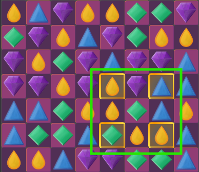
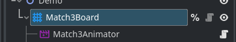
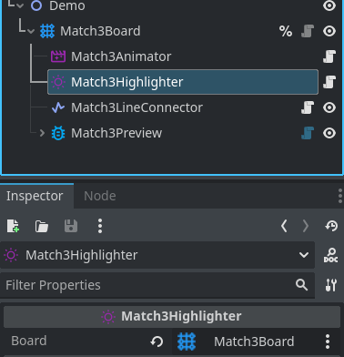
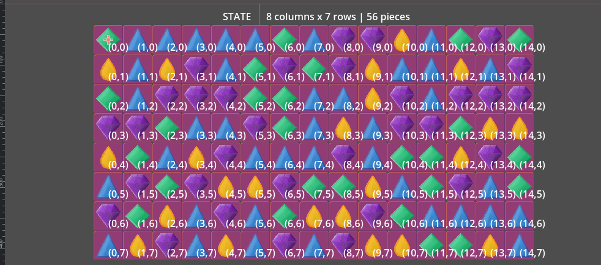
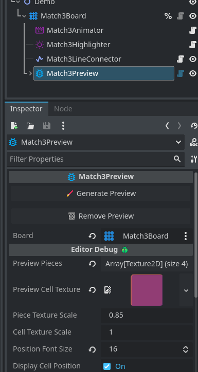

<div align="center">
	

<h3 align="center">Match3 Board</h3>

  <p align="center">
	The core logic and functionality you need to build engaging match-3 games
	<br />
	·
	<a href="https://github.com/ninetailsrabbit/match3-board/issues/new?assignees=ninetailsrabbit&labels=%F0%9F%90%9B+bug&projects=&template=bug_report.md&title=">Report Bug</a>
	·
	<a href="https://github.com/ninetailsrabbit/match3-board/issues/new?assignees=ninetailsrabbit&labels=%E2%AD%90+feature&projects=&template=feature_request.md&title=">Request Features</a>
  </p>
</div>

<br>
<br>

- [📦 Installation](#-installation)
- [Getting started 🚀](#getting-started-)
  - [Download and enable the plugin](#download-and-enable-the-plugin)
  - [Add the `Match3Board` node to your scene](#add-the-match3board-node-to-your-scene)
  - [Create a `Match3BoardConfiguration` resource](#create-a-match3boardconfiguration-resource)
    - [Available normal \& special pieces](#available-normal--special-pieces)
      - [Match3PieceConfiguration](#match3piececonfiguration)
        - [Scene](#scene)
        - [ID](#id)
        - [Name \& Description](#name--description)
        - [Weight](#weight)
        - [Type](#type)
        - [Shape](#shape)
        - [Color](#color)
        - [Priority](#priority)
        - [Can be](#can-be)
    - [Pieces collision layer](#pieces-collision-layer)
    - [Size](#size)
    - [Cells](#cells)
      - [Grid cell scene](#grid-cell-scene)
      - [Empty Cells](#empty-cells)
      - [Cell size](#cell-size)
      - [Cell offset](#cell-offset)
    - [Modes](#modes)
      - [Swap](#swap)
        - [Adjacent](#adjacent)
        - [Adjacent with diagonals](#adjacent-with-diagonals)
        - [Adjacent only diagonals](#adjacent-only-diagonals)
        - [Free](#free)
        - [Row](#row)
        - [Column](#column)
        - [Cross](#cross)
        - [Cross Diagonal](#cross-diagonal)
        - [Connect Line](#connect-line)
      - [Selection](#selection)
        - [Click](#click)
        - [Drag](#drag)
        - [Slide](#slide)
      - [Fill](#fill)
        - [Fall down](#fall-down)
        - [Side](#side)
        - [In place](#in-place)
    - [Start](#start)
      - [Auto Start](#auto-start)
      - [Min \& Max match](#min--max-match)
      - [Available moves on the start](#available-moves-on-the-start)
      - [Allow matches on the start](#allow-matches-on-the-start)
    - [Sequences](#sequences)
      - [Sequence rules](#sequence-rules)
        - [ID](#id-1)
        - [Priority](#priority-1)
        - [Strict size comparison](#strict-size-comparison)
        - [Shapes](#shapes)
        - [Piece to spawn](#piece-to-spawn)
        - [Target pieces](#target-pieces)
        - [Enabled shapes](#enabled-shapes)
    - [Animation flows](#animation-flows)
      - [Draw cells \& pieces animation](#draw-cells--pieces-animation)
      - [Sequence animation](#sequence-animation)
      - [Fall animation](#fall-animation)
      - [Fill animation](#fill-animation)
      - [Delay after shuffle](#delay-after-shuffle)
- [Match3 Animator](#match3-animator)
  - [Signals](#signals)
  - [Animation Hooks](#animation-hooks)
- [Match3 Highlighter](#match3-highlighter)
  - [Highlighter hooks](#highlighter-hooks)
- [Match3 Line Connector](#match3-line-connector)
  - [Parameters](#parameters)
    - [Match3Board](#match3board)
    - [Confirm \& Cancel match input action](#confirm--cancel-match-input-action)
- [Match3 Editor preview 🪲](#match3-editor-preview-)
  - [Parameters](#parameters-1)
    - [Match3Board](#match3board-1)
    - [Generate \& Remove preview](#generate--remove-preview)
    - [Preview pieces textures](#preview-pieces-textures)
    - [Preview cell texture](#preview-cell-texture)
    - [Cell \& Piece texture scale](#cell--piece-texture-scale)
    - [Display position](#display-position)
    - [Position font size](#position-font-size)

# 📦 Installation

1. [Download Latest Release](https://github.com/ninetailsrabbit/match3-board/releases/latest)
2. Unpack the `ninetailsrabbit.match3_board` folder into your `/addons` folder within the Godot project
3. Enable this addon within the Godot settings: `Project > Project Settings > Plugins`

To better understand what branch to choose from for which Godot version, please refer to this table:
|Godot Version|match3-board Branch|match3-board Version|
|---|---|--|
|[](https://godotengine.org/)|`main`|`2.x`|

# Getting started 🚀

This plugin shows in a simple way the customisation of to setup a Match3 Board and get started in no time.

For a quick start, do the following steps:

## Download and enable the plugin

Check the [Godot documentation](https://docs.godotengine.org/en/stable/tutorials/plugins/editor/installing_plugins.html) if you have not done so before

## Add the `Match3Board` node to your scene

You will see nothing in the `2D` tab and it's ok, we need to create some initial configuration before seeing anything on the screen.


You should be able to see a few exported parameters:

- **Configuration:** This is a `Resource` that holds the important board configuration.
- **Animator (Optional):** This links a `Match3Animator` node that contains your custom animations
- **Highlighter (Optional):** This links a `Match3Highlighter` node that contains your custom highlights
- **Line Connector (Optional):** This links a `Match3LineConnector` node that contains a custom `Line2D` to use when the selected mode is `ConnectLine`

## Create a `Match3BoardConfiguration` resource

The advantage of using one resource for the configuration is that you can create and save as many as you want to create different boards.

Once you create one you will see this new fields in the editor:


### Available normal & special pieces

The board internally uses the `Match3PieceConfiguration` Resource to know how to instantiate the pieces.

In order for the board to know they exist, the normal and special pieces must have an associated `Match3PieceConfiguration` and add it to these arrays.

#### Match3PieceConfiguration

##### Scene

The piece scene that will be instantiated, **is mandatory that the root node have attached a script that inherits from `Match3Piece`**

When you create a new `Match3Piece` scene, you'll see that the script contains exportable parameters, they are automatically initialised based on this Match3PieceConfiguration so your values will not be taken into account, it's recommended to set this values only on `Match3PieceConfiguration`

##### ID

The unique id for this piece, **if you left this field empty an error will be thrown when initializing the board in the `SceneTree`**.

##### Name & Description

PPurely informative for your use case, **these are optional fields.**

##### Weight

This field is a `Match3PieceWeight` resource that only needs a weight value. This is used to randomly generate the pieces in the board when enter the `Fill` state. The higher the value of the weight for the piece, the more likely it is to come out.

This value it's only used by pieces of `Normal` type.

##### Type

The type of the piece, there is available 3 options:

- **Normal**: A normal piece that can be combined with others through the `match_with()` function
- **Special**: A special piece that can be triggered and execute a special action
- **Obstacle**: An obstacle piece, this piece cannot be moved.

##### Shape

The custom shape for this piece, this is a text value which represents the shape of the piece.

##### Color

This color is informative just like the `shape`, it does not apply this colour to the piece on the board.

##### Priority

The priority is used at the time of consumption as a sequence if it is a `Normal` piece or at the time of execution if it is a `Special` piece.

##### Can be

A few boolean parameters to determine the actions that can be performed on this piece by the board.

- **Swapped:** Define if the piece can be swapped with others
- **Moved:** Define if the piece can be moved, means if it can be dropped after consuming sequences and has empty neighbour slots
- **Shuffled** Define if the piece whether it can be mixed when this action is executed
- **Triggered:** Define if the piece can be triggered, only used by `Special` type pieces
- **Replaced:** Define if the piece can be replaced, if active, other pieces could be drawn and replace this one without restriction
- **Consumed:** Define if the piece can be consumed in a sequence.

### Pieces collision layer

A value between 1 and 32. By default uses the layer 8 and is used internally by the board to enable drag and slide modes that detect the pieces.

### Size

The size of the board where `grid_width` represents the number of columns and `grid_height` the number of rows

### Cells

#### Grid cell scene

This is your scene that represents a grid cell in the board. **The root node needs to inherit from `Match3GridCell`**

#### Empty Cells

This parameter contains an array with board position values `Vector2i(column, row)` that represents empty cells that cannot contain pieces.

#### Cell size

The size of the cells, the textures of your cell scene will be adjusted to this size through scaling.

#### Cell offset

The separation between cells where `Vector2i(column_separation, row_separation)`

### Modes

This group represents the modes that will determine which swap moves are made, how pieces are selected and how they fall and fill on the board.

#### Swap

##### Adjacent

The piece can be swapped with adjacent cells _(not included diagonals)_


##### Adjacent with diagonals

The piece can be swapped with adjacent cells including diagonals


##### Adjacent only diagonals

The piece can be swapped only with adjacent diagonal cells



##### Free

The movement is free, pieces can be swapped with any other

##### Row

The pieces can be swapped on the same row it belongs


##### Column

The pieces can be swapped on the same column it belongs


##### Cross

The pieces can be swapped on the same column & row it belongs


##### Cross Diagonal

The pieces can be swapped on the complete adjacent diagonals


##### Connect Line

**This mode needs a `Match3LineConnector` added and configured as child of the board.** The pieces can be swapped connecting adjacent matchs from the last connected piece.


---

#### Selection

##### Click

The pieces are selected by click, clicking on it again deselects it. To make a swap you would have to click on the source piece and click again on the target piece.

##### Drag

The pieces can be dragged to do the swap, releasing the mouse will drop the piece. If there is a match, the swap is completed, if not, the piece returns to its cell of origin.

##### Slide

Same as drag but the piece stays in its original place, only when the mouse is released the movement is applied _(if valid)_.

#### Fill

##### Fall down

The pieces fall vertically if there are empty slots after consuming the combo sequences and entering the `Fall` state.

##### Side

The pieces still falls vertically but if they can't, they take into account whether the bottom diagonals are empty and move towards them.

##### In place

The pieces does not fall, new pieces are created where the combos were consumed and left empty cells.

### Start

These parameters are taken into account for the start of the board.

#### Auto Start

The cell and pieces are drawed once the node is `_ready` on the scene tree. When this property is false, you need to manually call the functions `draw_cells()` and `draw_pieces()` in this order to draw and activate the board.

#### Min & Max match

The minimum match by default it's always `3` and cannot be assigned a value below. This values defines the minimum pieces to be detected as a sequence and the maximum pieces which may contain.

#### Available moves on the start

The number of limited moves for this board. Each time it makes a complete cycle and returns to the `WaitForInput` state, 1 move is consumed. Set to `-1` so that there is no limit to movement

This property emits the signals `movement_consumed` and `finished_available_movements` when value changes. **This property is purely informative** and does not lock the board when it reaches zero. That decision will be made by you

#### Allow matches on the start

When this property is enabled, when the board draws the pieces and there are matches, the board goes to the `Consume` state. If not, th board will remove the matches for new pieces to ensure that there are no matches in the first movement.

### Sequences

This parameters are related around sequences, a sequence is a combination of pieces that can be consumed.

#### Sequence rules

An array of `SequenceConsumeRule`, these rules define which pieces are created in which combinations

##### ID

The unique id of the rule

##### Priority

The rules are checked in order of priority, a rule with a higher priority will be checked first.

##### Strict size comparison

When this property is enabled, the sequence size has to be the same as `target_pieces` when checked.

This means that a sequence rule with a 4 blue pieces that receives a sequence of 5 blue pieces will fail the check but if this property were false, the rule would apply when having at least 4 blue pieces.

##### Shapes

An array of `Match3Sequence.Shape`, the received sequence must be one of these shapes in order to be accepted

##### Piece to spawn

A `Match3PieceConfiguration` that will be spawn when the rule is accepted

##### Target pieces

An amount of `Match3Configuration` the sequence must have for the rule to be accepted.

##### Enabled shapes

Enables or disables the sequences that the board can accept.

- Horizontal
- Vertical
- T-Shape
- L-Shape

### Animation flows

Animations can be executed in 2 flows: `Serial` or `Parallel`

- **Serial:** an animation will be released after the previous one.
- **Parallel:** They all run at the same time

##### Draw cells & pieces animation

The animations that draw cells and pieces to get the board ready

##### Sequence animation

The animation that runs when a sequence is consumed in the board

##### Fall animation

The animation that runs when enter the `Fall` state and the fall movements are applied according to the chosen mode.

##### Fill animation

The animation that runs when enter the `Fill` state and pieces spawned are applied according to the chosen mode.

##### Delay after shuffle

A timeout before unlocking the board after a shuffle.

# Match3 Animator

This script provides functions that are executed at certain points on the board, this is where you can include your own animations.

To create your own, create a new script that inherits from `Match3Animator` and add it as a child node to the `Match3Board`



**_In the demo folder provide with this addon you can find a complete example of a custom animator_**

## Signals

When an animation start or end, signals `animation_started` `animation_finished` are emitted.

```swift
signal animation_started(animation_name: StringName)
signal animation_finished(animation_name: StringName)
```

You can access to the current running animation on property `current_animation`

## Animation Hooks

```swift
// Used when the board draw cells for the first time, it receives all the drawed cells
func draw_cells(cells: Array[Match3GridCell]) -> void:

// Used when the board draw pieces for the first time, it receives all the drawed pieces
func draw_pieces(pieces: Array[Match3Piece]) -> void


// When a valid swap is applied, receives the involved pieces and the target positions
func swap_pieces(
  from_piece: Match3Piece,
  to_piece: Match3Piece,
  from_piece_position: Vector2,
  to_piece_position: Vector2
)

// When a valid swap is rejected, e.g: no match after swap, receives the involved pieces and the target positions
func swap_rejected_pieces(
  from_piece: Match3Piece,
  to_piece: Match3Piece,
  from_piece_position: Vector2,
  to_piece_position: Vector2
  )


// When sequences are consumed in the board, only run when the sequence animation flow is Serial
func consume_sequence(sequence: Match3Sequence) -> void

// When sequences are consumed in the board, only run when the sequence animation flow is Parallel
func consume_sequences(sequences: Array[Match3SequenceConsumer.Match3SequenceConsumeResult]) -> void

// When falling pieces after consuming last sequences from the board. Only run when the fall animation flow is Serial
func fall_piece(movement: Match3FallMover.FallMovement) -> void

// When falling pieces after consuming last sequences from the board. Only run when the fall animation flow is Parallel
func fall_pieces(movements: Array[Match3FallMover.FallMovement]) -> void

// When filling pieces after falling pieces from the board. Only run when the fill animation flow is Serial
func spawn_piece(cell: Match3GridCell) -> void

// When filling pieces after falling pieces from the board. Only run when the fill animation flow is Parallel
func spawn_pieces(cells: Array[Match3GridCell]) -> void

// When a special piece is triggered on the board.
func trigger_special_piece(piece: Match3Piece) -> void

// When a piece drag ended, only runs if the mode is Drag or Slide.
func piece_drag_ended(piece: Match3Piece) -> void

// When a shuffle action is made on the board
func shuffle(movements: Array[Match3Shuffler.ShuffleMovement]) -> void
```

# Match3 Highlighter

If you want to apply highlight effects when a piece is selected on the board, this is the place to do it.

The setup is exactly the same as the `Match3Animator`, to create your own, create a new script that inherits from `Match3Highlighter` and add it as a child node to the `Match3Board`

**\_In the demo folder provide with this addon you can find a complete example of a custom highlighter**



## Highlighter hooks

The advantage of receiving the cell is that if it contains a piece, it can also be treated here.

In the case of the `ConnectLine` mode, the pieces are received instead of cells but nothing happens because their associated cell can be accessed via the `piece.cell` property from `Match3Piece`

You have access to the `current_highlighted_cells` and `current_highlighted_pieces` from this class when an highlight is active

```swift
// Highlight the cells after select a piece. Receive the valid cells based on the selected swap mode.
func highlight_cells(cells: Array[Match3GridCell]) -> void

// Highlight an individual cell after select a piece. This cells comes from the highlight_cells hook
func highlight_cell(cell: Match3GridCell) -> void

// Remove the highlights after unselect a piece either by user input or by applying a swap movement.
func remove_highlight() -> void

// CALLBACKS //
func on_selected_piece(piece: Match3Piece) -> void

func on_unselected_piece(piece: Match3Piece) -> void

// The pieces by the line connector are received here as it is a different flow.
func on_connected_piece(piece: Match3Piece) -> void

func on_confirmed_line_connector_match(pieces: Array[Match3Piece]) -> void

func on_canceled_line_connector_match(pieces: Array[Match3Piece]) -> void

```

---

# Match3 Line Connector

This node allows you to customise the `Line2D` used by the board when the selected swap mode is `ConnectLine`.

## Parameters

### Match3Board

A target `Match3Board`, if this value is null the node will try to get the board by the group name from the scene tree

### Confirm & Cancel match input action

They are only taken into account when the board selection mode is `Click`. This mode needs a manual confirmation and cancellation unlike drag & slide which works by holding and releasing the mouse.

# Match3 Editor preview 🪲

With this node, you can see how much space the board will take up in the scene. It is a very simple node just to see the grid in the editor. The display position is in the format `Vector2(column, row)`



---

## Parameters



### Match3Board

The `Match3Board` from which to read the `Match3Configuration`, if this value is null the node will try to get the board by the group name from the scene tree

### Generate & Remove preview

You can manually update the board with this tool buttons. Take into account that if you change any configuration on the main board, they are not reflected in the preview. You have to manually re-generate the preview with this buttons.

Contrary to the parameters of this node, any changes will be updated in the editor.

### Preview pieces textures

An array of textures to draw the pieces inside the cells, they does not need to be the same as the pieces you have set up in the board

### Preview cell texture

The texture to use to display the board cells

### Cell & Piece texture scale

The textures are scaling based on the `Match3Configuration.cell_size`, this value is usually lower in the pieces to fit better into the cell.

### Display position

Displays the position in the board for each cell with the format `Vector2(column, row)`

### Position font size

The font size of the label that displays the cell position
