<div align="center">
	

<h3 align="center">Match3 Board</h3>

  <p align="center">
	The core logic and functionality you need to build engaging match-3 games
	<br />
	·
	<a href="https://github.com/ninetailsrabbit/match3-board/issues/new?assignees=ninetailsrabbit&labels=%F0%9F%90%9B+bug&projects=&template=bug_report.md&title=">Report Bug</a>
	·
	<a href="https://github.com/ninetailsrabbit/match3-board/issues/new?assignees=ninetailsrabbit&labels=%E2%AD%90+feature&projects=&template=feature_request.md&title=">Request Features</a>
  </p>
</div>

<br>
<br>

- [📦 Installation](#-installation)
- [Getting started 🚀](#getting-started-)
- [Editor preview 🪲](#editor-preview-)
  - [Parameters](#parameters)
- [Board Parameters](#board-parameters)
  - [Size](#size)
  - [Match configuration](#match-configuration)
    - [Pieces collision layer](#pieces-collision-layer)
    - [Swap mode](#swap-mode)
      - [Adjacent](#adjacent)
      - [Adjacent with diagonals](#adjacent-with-diagonals)
      - [Adjacent only diagonals](#adjacent-only-diagonals)
      - [Free](#free)
      - [Row](#row)
      - [Column](#column)
      - [Cross](#cross)
      - [Cross Diagonals](#cross-diagonals)
      - [Connect Line](#connect-line)
    - [Click mode](#click-mode)
    - [Customizable Input actions](#customizable-input-actions)
    - [Fill modes](#fill-modes)
- [Add spawn pieces to the board](#add-spawn-pieces-to-the-board)
- [GridCellUI](#gridcellui)
  - [Position](#position)
  - [Empty cell](#empty-cell)
  - [Get neighbour cells](#get-neighbour-cells)
  - [Piece](#piece)
    - [Information](#information)
    - [Add or remove](#add-or-remove)
    - [Swap (internal use, not recommended for manual use )](#swap-internal-use-not-recommended-for-manual-use-)

# 📦 Installation

1. [Download Latest Release](https://github.com/ninetailsrabbit/match3-board/releases/latest)
2. Unpack the `ninetailsrabbit.match3_board` folder into your `/addons` folder within the Godot project
3. Enable this addon within the Godot settings: `Project > Project Settings > Plugins`

To better understand what branch to choose from for which Godot version, please refer to this table:
|Godot Version|match3-board Branch|match3-board Version|
|---|---|--|
|[](https://godotengine.org/)|`main`|`1.x`|

# Getting started 🚀

To start creating your **Match3** game you have available 3 pillars provided from this plugin to build it:

- 🔳 The `Match3Board` node handles the core game mechanics, including grid size, piece setup, and swap movement mode.
- 💎 The `PieceUI` node provides the visual representation and interactive behavior of game pieces. You can customize it or create your own variations.
- 📝 The `PieceDefinitionResource` defines the properties and behaviors of each piece type, such as its match logic and special abilities.

# Editor preview 🪲

This feature provides a preview of your game board before it's fully initialized. This allows you to:

- **_Assess Layout:_** Visualize the size and layout of your board.
- **_Add Empty Spaces:_** Easily adjust the spacing between game pieces.
- **_Experiment with Textures:_** Test different textures for cells and pieces without affecting the final game.

You have available default textures on this plugin to visualize a preview in the editor, feel free to use your own ones. The nodes that are drawn are not the scenes that the board uses in the game, they are just sprites.

⚠️ _This preview is temporary and will be removed when the game starts_ ⚠️

---

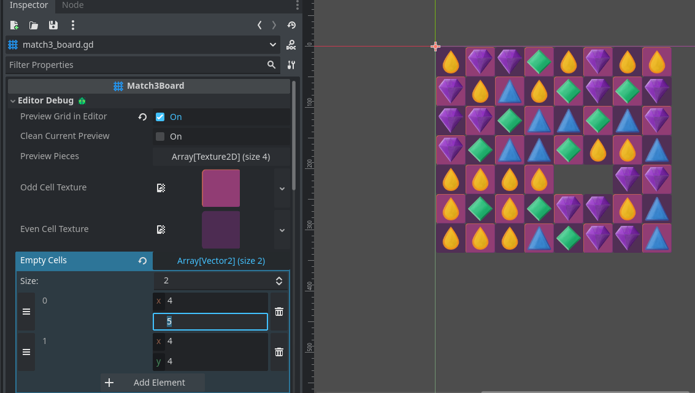

---

## Parameters

- **Preview grid in editor:** Enable or disable the preview
- **Clean current preview:** Removes the current preview from the editor
- **Preview pieces:** The textures to preview in the grid randomly placed on each generation
- **Odd cell texture:** The texture to place in odd cell positions in the board
- **Even cell texture:** The texture to place in even cell positions in the board
- **Empty cells:** Set empty cells where a piece shall not be drawn in the shape of Vector2i(row, column)

# Board Parameters

---

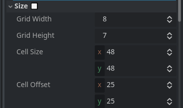

---

## Size

- **Grid width:** The row width of the grid, a width of 7 means that 7 pieces will be drawed by row
- **Grid height:** The column height of the grid, a height o 8 means that 8 pieces will be drawed by column
- **Cell size:** The size of the cell in the world in the shape of Vector2(x, y). It's recommended to keep this values equals for better display
- **Cell offset:** The offset from the corner if you want to create more space.

ℹ️ **_With the `preview enabled`, any changes you make to the board's parameters \_(like grid size or piece definitions)\_ will be instantly reflected in the preview window. This allows you to quickly iterate and experiment with different configurations_** ℹ️

## Match configuration

---

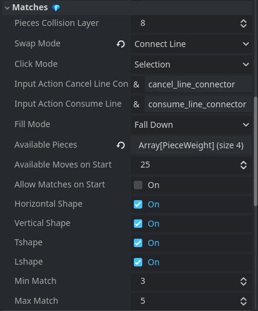

---

### Pieces collision layer

The collision layer where the pieces are set. Its values are from `1 to 32` and this allows you to not override existing layers in your Godot project

### Swap mode

This is the `swap_mode` to find matches on the pieces. **They can be changed at runtime** and you have the next ones availables:

#### Adjacent

An individual piece can swap with adjacent pieces but diagonal neighbours are not included.

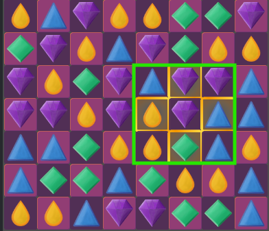

#### Adjacent with diagonals

Same as adjacent mode but this time diagonal neighbours are included


#### Adjacent only diagonals

Same as adjacent mode but this time only diagonal neighbours are included

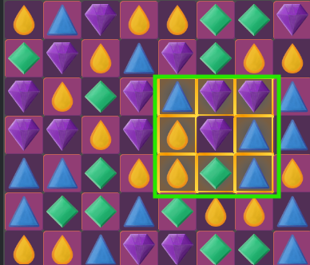

#### Free

The piece can be swapped with any other

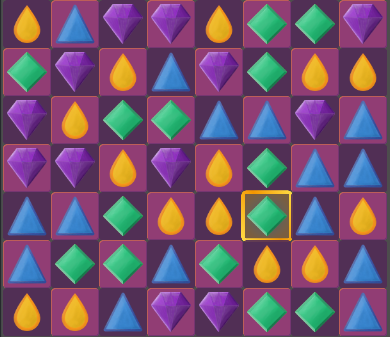

#### Row

The piece can be swapped in the entire row it belongs

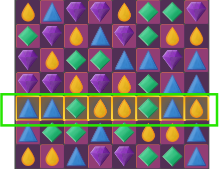

#### Column

The piece can be swapped in the entire column it belongs

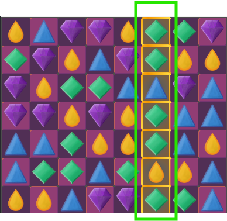

#### Cross

The piece can be swapped on a cross that is a mix of `Row & Column`

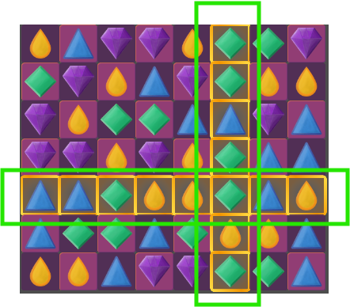

#### Cross Diagonals

The piece can be swapped on cross but using diagonals instead

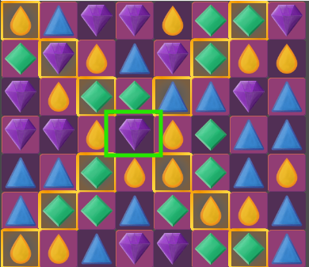

#### Connect Line

Connect the adjacent pieces from a line that originates from the selected cell until the maximum match of pieces or triggered manually.

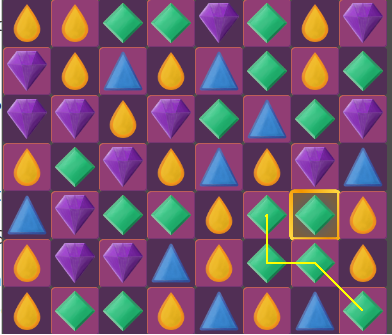

### Click mode

This is the `click_mode` to manipulate pieces in the board with the current swap mode. **They can be changed at runtime** and you have the next ones availables:

- **Selection:** You click on the piece to select and another click in the target piece to swap.
- **Drag:** You hold the mouse and drag the piece into the target piece to swap. When the `swap_mode` is `ConnectLine` the piece is not dragged but instead you need to hold the mouse to keep connecting lines.

### Customizable Input actions

When you're using the `click_mode` **Selection** and the `swap_mode` **ConnectLine**, there is two input actions you can define to `consume` or `cancel` the line connector matches.

⚠️ If this action does not exists, by default the `consume` is triggered with `MOUSE_BUTTON_LEFT` and the `cancel` with `MOUSE_BUTTON_RIGHT` ⚠️

---

### Fill modes

This option defines the behaviour when the board is filling the empty gaps after consuming previous sequences of pieces.

You have available the following ones:

- **Fall down:** The pieces fall down into the deepest empty column cell as they are drawn into the board
- **Side**: Same behaviour as **Fall down** but if there is no empty space in the column and there is an empty space in the adjacent diagonal, the piece will move there.
- **In place:** The pieces spawn in the same cell without gravity effects

# Add spawn pieces to the board

# GridCellUI

Each square in the preview represents a `GridCellUI` node. This node serves as a visual representation of a cell within the game grid and is not designed for customization _(although nothing prevents you from doing so)_

The Swaps between pieces are done via this `GridCellUI` node so **_the pieces are never directly interacted with_**, it is the cells that contain the checks and commands to see if the swap is possible or not.

## Position

To obtain the position of a cell you have access to variables `row`, `column` and method `board_position()`. This method returns a `Vector2i(row, column)`.

In addition, there are methods to check for more advanced cases with other cells to know the relative position in the board

```swift
func in_same_row_as(other_cell: GridCellUI) -> bool

func in_same_column_as(other_cell: GridCellUI) -> bool

func in_same_position_as(other_cell: GridCellUI) -> bool

func in_same_grid_position_as(grid_position: Vector2) -> bool

func is_row_neighbour_of(other_cell: GridCellUI) -> bool

func is_column_neighbour_of(other_cell: GridCellUI) -> bool

func is_adjacent_to(other_cell: GridCellUI) -> bool

func in_diagonal_with(other_cell: GridCellUI) -> bool:
```

---

There are more methods available to determine if it is a corner or a border

```swift

func is_top_left_corner() -> bool:

func is_top_right_corner() -> bool

func is_bottom_left_corner() -> bool

func is_bottom_right_corner() -> bool

func is_top_border() -> bool

func is_bottom_border() -> bool

func is_right_border() -> bool

func is_left_border() -> bool:
```

## Empty cell

If the position of this cell match with any of the `empty_cells` vectors from the `Match3Board`, this cell will change the variable `can_contain_piece` to false and you can choose if draw the background texture or not with the variable `draw_background_texture`.

## Get neighbour cells

When the board is drawed and cells initialized, each one has access to the adjacent neighbours, you can access them with the variables:

```swift
neighbour_up,
neighbour_bottom,
neighbour_right,
neighbour_left,
diagonal_neighbour_top_right,
diagonal_neighbour_top_left,
diagonal_neighbour_bottom_right,
diagonal_neighbour_bottom_left
```

In addition you can access the neighbour cells that are available through the methods:

```swift
func available_neighbours(include_diagonals: bool = false) -> Array[GridCellUI]

func diagonal_neighbours() -> Array[GridCellUI]:
```

## Piece

The cell has direct access to the related piece on variable `current_piece`, this `GridCellUI` class provides useful methods to manipulate them:

### Information

Available methods to know if the cell has a piece or not

```swift
func is_empty() -> bool

func has_piece() -> bool
```

### Add or remove

Methods to assign or remove a piece. This methods does not remove the piece from the board UI, only from the cell.

```swift
// Assign a piece only if the cell is empty unless "overwrite" is true
func assign_piece(new_piece: PieceUI, overwrite: bool = false) -> void

// Replace the current piece to the new one even if the cell is empty
func replace_piece(new_piece: PieceUI) -> PieceUI

// Remove the current piece and return it if the cell was not empty.
func remove_piece() -> PieceUI?
```

### Swap (internal use, not recommended for manual use )

All the swap are dones through the cells, although **it is not recommended to use these methods directly.** Rather, set up the pieces and their rules individually and consume them with a `SequenceConsumer`.

```swift
func swap_piece_with(other_cell: GridCellUI) -> bool

func can_swap_piece_with(other_cell: GridCellUI) -> bool

```
